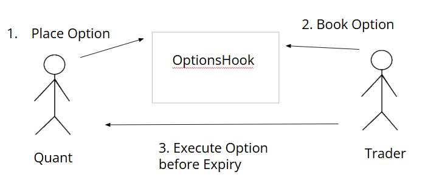

# OptionsHook

OptionsHook is a decentralized smart contract framework that allows users to create and manage options trading workflows. The workflow consists of three main steps: **Place Option**, **Book Option**, and **Execute Option**. This framework is designed for financial enthusiasts and traders looking for on-chain options trading with enforced time-based expirations.

---

## Table of Contents
- [OptionsHook](#optionshook)
  - [Table of Contents](#table-of-contents)
  - [Overview](#overview)
  - [How It Works](#how-it-works)
  - [Features](#features)
  - [Pipeline](#pipeline)
  - [Getting Started](#getting-started)
    - [Prerequisites](#prerequisites)

---

## Overview

OptionsHook enables a seamless workflow for options trading between two users:
- **User A (Quant)**: Places the option by locking funds and specifying output and expiration details.
- **User B (Trader)**: Books the option and locks the required funds to match the option.
- **Execution**: The booked option must be executed before expiration, ensuring a fair and timely swap of funds.

The protocol leverages smart contracts to enforce transparency, trustlessness, and automation in the options trading process.

---

## How It Works

The contract operates in three phases:

1. **Place Option**:
   - User A specifies the output amount, input token type, and expiration date.
   - Funds are locked in the contract for the specified option.

2. **Book Option**:
   - User B locks the required output amount, effectively "booking" the option.
   - The option is marked as **Reserved** for the specific user.

3. **Execute Option**:
   - Before expiration, User B executes the option.
   - The locked funds are swapped between User A and User B, completing the transaction.

If the option is not executed before expiration, it becomes invalid, and funds are returned accordingly.

---

## Features

- **Decentralized Options Trading**: Fully on-chain mechanism for options trading.
- **Timely Execution**: Enforces expiration dates for fair trading.
- **Secure Fund Locking**: Funds are held securely in the smart contract.
- **Transparent Workflow**: State transitions for options (e.g., Placed → Reserved → Executed) are visible to all participants.

---

## Pipeline

Below is a high-level representation of the workflow:

1. **Place Option**  
   - User A (Quant) locks funds in the `OptionsHook` contract.
   - Specifies:
     - Input token type
     - Output token amount
     - Expiration time

2. **Book Option**  
   - User B (Trader) locks the output amount.
   - The option is now reserved and can only be executed by User B.

3. **Execute Option**  
   - User B executes the option before the expiration time.
   - Locked funds are swapped, completing the trade.



---

## Getting Started

Follow these instructions to build and test the project locally.

### Prerequisites

- Install [Foundry](https://getfoundry.sh/):
  ```bash
  curl -L https://foundry.paradigm.xyz | bash
  foundryup
